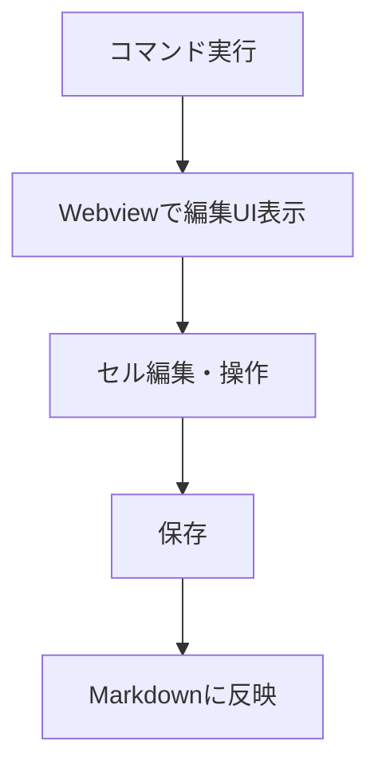

# VSCode拡張機能：Markdown Table Editor

## 概要
Markdownファイル内のテーブル部分をExcelライクなUIで直感的に編集できるVSCode拡張機能です。  
コマンドや右クリックメニューからテーブル編集画面を呼び出し、編集内容をMarkdownに即時反映します。

---

## 主な機能

- **テーブル編集UIの起動**
  - コマンドパレットまたは右クリックメニューから「AddTable」「EditTable」コマンドで編集画面を開く

- **Excelライクな編集操作**
  - 行・列の追加／削除
  - セルの結合／分割
  - セルのコピー／貼り付け
  - Undo／Redo
  - セル範囲選択
  - Markdownプレビュー

- **Markdownへの反映**
  - 編集内容を保存すると、元のMarkdownテーブルに即時反映

---

## サポート対象

- 標準的なMarkdownテーブルのみ対応（GFM拡張や複雑な表記は今後検討）

---

## 操作フロー

1. Markdownファイルを開く
2. コマンドパレットまたは右クリックメニューから「AddTable」または「EditTable」を選択
3. Webviewベースのテーブル編集画面が表示される
4. 編集後「保存」ボタンでMarkdownに反映

---

## UIイメージ

---

## 今後の拡張案

- CSVインポート／エクスポート
- テーブルのスタイル設定
- GFM拡張記法や複雑なテーブルへの対応
- テーブルの並び替え・フィルタ機能

---

## 開発ロードマップ（案）

1. コマンド登録・Webview呼び出しの実装
2. Markdownテーブル検出・抽出ロジック
3. テーブル編集UI（行列操作・セル編集・Undo/Redo・プレビュー）
4. 編集内容のMarkdown反映
5. 既存テーブル編集機能
6. 拡張機能のテスト・リリース
7. 今後の拡張機能追加