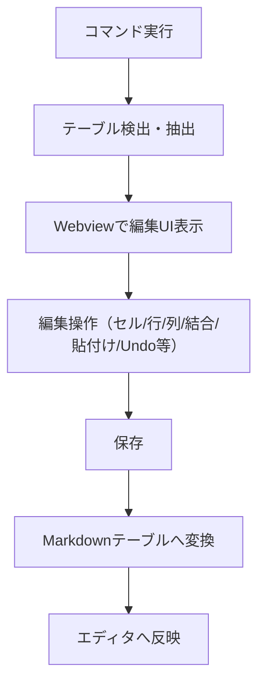

# Architecture: VSCode拡張機能「Markdown Table Editor」

## 目的
Markdownファイル内のテーブルをExcelライクなUIで直感的に編集できるVSCode拡張機能を実現する。

---

## 技術構成

- **言語**: TypeScript
- **UI**: Webview（HTML/CSS/JavaScript）
- **VSCode API**: コマンド登録、エディタ操作、Webview連携
- **データ変換**: Markdownテーブル⇔内部データ構造（2次元配列）

---

## 機能構成

1. **コマンド登録・起動**
   - コマンドパレット/右クリックメニューから「AddTable」「EditTable」起動
   - `package.json`でコマンド・メニューを定義

2. **テーブル検出・抽出**
   - Markdown内のテーブル範囲を正規表現等で検出
   - 選択範囲またはカーソル位置から既存テーブルを抽出

3. **Webviewによる編集UI**
   - セル範囲選択、行・列追加削除、セル結合・分割、コピー・貼り付け、Undo/Redo
   - 編集内容のプレビュー表示

4. **編集内容の反映**
   - 編集結果をMarkdownテーブル形式に変換し、エディタに書き戻す

5. **今後の拡張**
   - CSVインポート/エクスポート、テーブルスタイル設定、GFM拡張対応

---

## データフロー

---

## 主要コンポーネント

- **extension.ts**  
  コマンド登録・Webview起動・エディタ操作

- **webview/index.html / main.js**  
  テーブル編集UI、セル操作ロジック、プレビュー

- **tableParser.ts**  
  Markdownテーブル⇔2次元配列変換ロジック

---

## 開発手順（参考）

1. Yeoman（generator-code）でプロジェクト雛形作成
2. コマンド登録・Webview呼び出し実装（extension.ts, package.json）
3. Markdownテーブル検出・抽出ロジック実装
4. Webview UI（HTML/JS）でテーブル編集機能実装
5. 編集内容のMarkdown反映処理
6. 動作確認・テスト
7. README/architecture.md整備
8. 今後の拡張機能追加

---

## 補足

- 標準Markdownテーブルのみ対応（GFM拡張は今後検討）
- UI/UXはExcelライクな操作性を重視
- コード分割・テスト容易性を考慮した設計